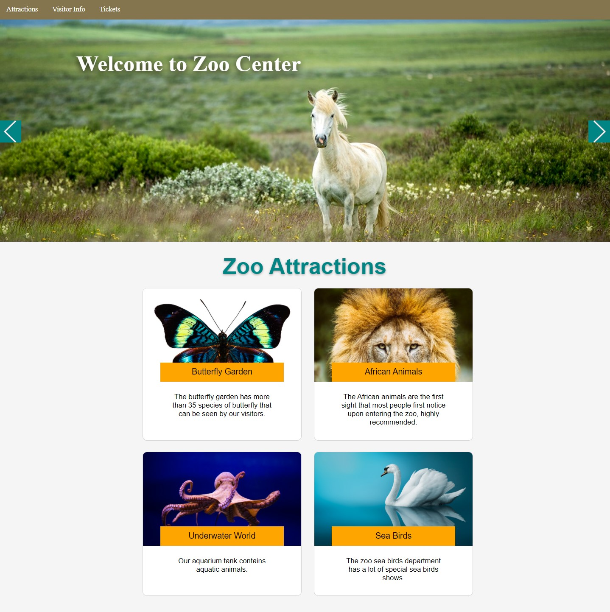

# Module 8: Using Layouts, CSS and JavaScript in ASP.NET Core MVC

## Lab: Using Layouts, CSS and JavaScript in ASP.NET Core MVC

1. **Nombres y apellidos:** Francisco Javier Moreno Quevedo
2. **Fecha:** 02/12/2020
3. **Resumen del Ejercicio:** Añadir los componentes necesarios para hacer funcional la aplicacion de venta de un Zoo 2/4
4. **Dificultad o problemas presentados y como se resolvieron:** Ninguna

- Ejercicio 2: Using CSS 
  - Añadimos el fichero de estilos **zoo-style.css**
  - Añadimos el enlace de este fichero a la vista  **_Layout.cshtml**
  - Completamos con estilos el fichero  **zoo-style.css**

